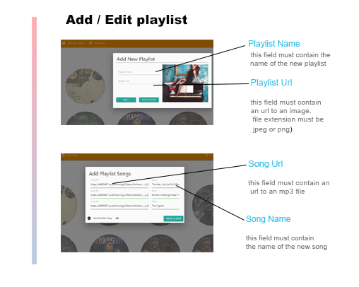

**Demo**

<!-- <video width="320" height="240" controls>
  <source src="Docs/readme/Audio_Playlist.mp4" type="video/mp4">
</video> -->
<!--  -->

<!-- ***INSERT GRAPHIC HERE (include hyperlink in image)*** -->

# My Audio Playlist

> A CRUD and SPA application that allow to add create ,  remove , update , delete , and of course  listen  to your favorite songs.

> Jquery , PHP , Materialize

**Technologies**

- HTML5
- HTML Audio Api
- CSS 
- Media queries
- Materialize
- Fully Responsive
- Javascript
- jQuery
- Ajax
- PHP
- MySql  
- Module Patterns  
- ES6 Features

## License

- **[MIT license](http://opensource.org/licenses/mit-license.php)**
- Copyright 2015 © <a href="http://www.nemorak.com" target="_blank">nemorak.com</a>.
