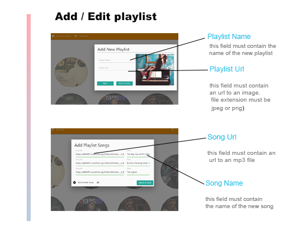

<video width="320" height="240" controls>
  <source src="Docs/readme/Audio_Playlist.mp4" type="video/mp4">
</video>
<!--  -->

<!-- ***INSERT GRAPHIC HERE (include hyperlink in image)*** -->

# My Audio Playlist

> A CRUD and SPA application that allow to add create ,  remove , update , delete , and of course  listen  to your favorite songs.

> Jquery , PHP , Materialize

**Technologies**

- HTML5
- HTML Audio Api
- CSS 
- Media queries
- Materialize
- Fully Responsive
- Javascript
- jQuery
- Ajax
- PHP
- MySql  
- Module Patterns  
- ES6 Features

- Use <a href="http://recordit.co/" target="_blank">**Recordit**</a> to create quicks screencasts of your desktop and export them as `GIF`s.
- For terminal sessions, there's <a href="https://github.com/chjj/ttystudio" target="_blank">**ttystudio**</a> which also supports exporting `GIF`s.

**Demo**

**ttystudio**

---

## Screenshots

> Or Contributors/People

| <a href="http://fvcproductions.com" target="_blank">**FVCproductions**</a> | <a href="http://fvcproductions.com" target="_blank">**FVCproductions**</a> | <a href="http://fvcproductions.com" target="_blank">**FVCproductions**</a> |
| :---: |:---:| :---:|
|     |  |   |
| <a href="http://github.com/fvcproductions" target="_blank">`github.com/fvcproductions`</a> | <a href="http://github.com/fvcproductions" target="_blank">`github.com/fvcproductions`</a> | <a href="http://github.com/fvcproductions" target="_blank">`github.com/fvcproductions`</a> |

- You can just grab their GitHub profile image URL
- You should probably resize their picture using `?s=200` at the end of the image URL.

---

## License

- **[MIT license](http://opensource.org/licenses/mit-license.php)**
- Copyright 2015 © <a href="http://fvcproduction.com" target="_blank">FVCproductions</a>.
